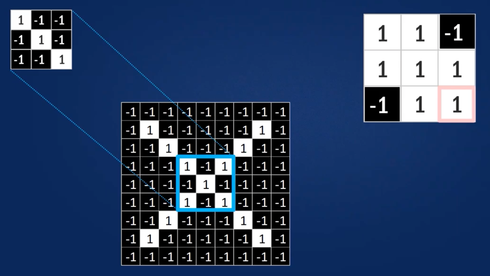
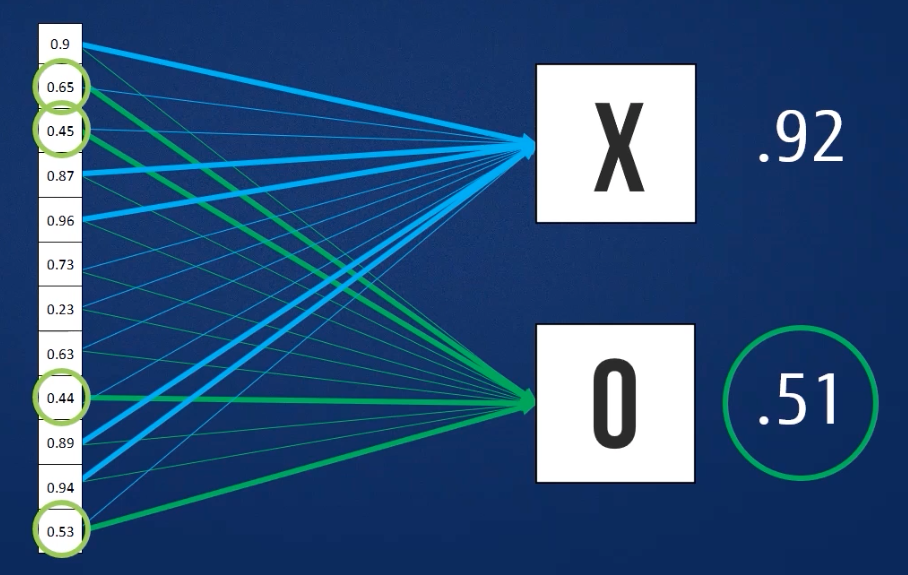
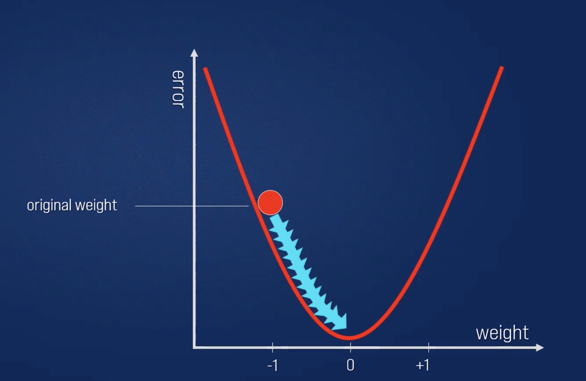

# CNNs Convolutional Neural Networks

## Test datenset: 
    MNIST (Modified National Institute of Standards and Technology)

## Feature:
Beschreibt die Eigenschaften von Eingabedaten, z.B:
1. Pixelwerte in einenm Bild
2. Zanhlenwerte wie Umsatz, Alter, Anzahl,...
3. Bestimmte Buchstaben in einem Dokument
4. ...
    
Die anzahl an möglichen Features ist dabei nicht limitiert
    

## 1. Filtern:
1. Ausrichten der Features auf den Bildausschnitt.
2. Multiplikation eines jeden Bildpixel mit dem zugehörigen Feature-Pixel
3. Addition der Produkte.
4. Teilen durch die Gesamtzahl der Pixel des Features.

## 2. Convolution
Pürfen auf alle möglichen Übereinstimmungen

- Feature + convolution => feature-map

### Convolution layer
Ein Bild wird zu einem Stapel gefilterter Bilder

## 3. Pooling
Verkleinern des Bildstapels
1. Wählen einer Fenstergröße (normaleweise 2x2px oder 3x3px)
2. Wählen einer Schnittweite (typisch: 2px)
3. Mit dem Fenster über die gefilterten Bilder "gehen"
4. Aus jedem Fenster den Maximalwert nehmen

### Stapel von Bilder werden verkleinert
Wir behalten bestimmte Merkmale, auch wenn das Bild nicht perfekt ist

## 4. Normalisierung (Umstritten)
1. Reduktion von Rechnemaufwand durch Modifikation einzelner Werte.
2. Negative Zahlen werden auf Null (0) gesetzt.
### Rectified Linear Units (Relu's)

## Layer werden in Schichten (Stacks) angeordnet
Das Ergebnus einer Schicht wird zur Eingangsinformation (Input) der nächsten Schicht

## Erzeugung tiefer Schichten (Deep Stacking)
Ebenen können einige (oder auch viele) Male wiederholt werden

=> Frage: wie kommmen wir zu Ergebniss ?

## Fully connected Layer
Jeder Wert ist stimmberechtigt in Bezug auf das Ergebnis

Zukünftige Werte stimmen für X oder O ab

Eine Liste von Features wird zu einer Liste von Stimmen

Diese können auch gestapelt werden

Ein Satz von Pixel wird zu einem Satz von Stimmen

## Beispiel code:
### input-layer: 
(None, 244, 244, 3) => Eingabeformat 244x244 Px, RGB: 3
### block1-conv1 (Conv2D): 
(None, 224, 224, 64) => Features: 64

in der ausgabe sehen wir:
1. Bildgrösser werden verkleinert
2. Anzahl der Features zunehmmen
=> immer mehr details 
   
###Interessant:
Total params: 138,357,544

# Woher kommen all die magischen Zahlen ?
- Features in convolutional layers
- Voting weights in fully connected layers
## Backprogagation
Fehler = richtige Anwort - aktuelle Antwort

### Gradientenabstieg (Grdient descent)
Für jedes Features-Pixel und jde Gewichtung (weight) passen wir das Gewicht ein wenig nach oben und unten an und sehen, 
wie der Fehler sich ändern

### Slope

### Fehlerfunktion
Den Slope direkt berechnen

### Lernrate
#### Klein
Lernrate ist zu klein und benötigt zu viel Rechnenleistung

#### Gross
Lernrate ist zu gross und verhält sich unvorhersehbar

#### Optimal
Erreicht schnell niedrige Fehlerwerte

#### Learnrate vs Performance
Erreicht schnell niedrige Fehlerwerte

#### Falsches Minima vs globale Minima

## Hyperparameter
### Convolution
- Anzahl der Features
- Größe der Features
### Pooling
- Fenstergröße
- Fensterschnitt
### Fully Connected
- Anzahl der Neuronen
## Architektur
- Wie viele von jeden Layer ?
    * in welcher Reihensfolge ?
## Nicht nur Bilder
- Alle 2D- (oder 3D-) Daten
- Dinge, die näher beieinander liegen, sind enger miteinander verbunden als Dinge, die weit weg sind
### Bilder

### Sound

### Text

## Limitierungen
- ConvNets erfassen nur locale "räumliche" Muster in Daten
- Wenn die Daten nicht wie ein Bild aussehen können, sind ConvNets weniger nützlich
  
## CNN Daumenregel
Wenn die Daten genauso nutzlich sind, nachdem wir eine Ihrer Spalten miteinander vertauscht haben, dann können wir
Convolutional Neural Networks nicht verwenden
CNN sind hervorragend darin, Muster zu finden und damit Bilder zu klassifizieren.
